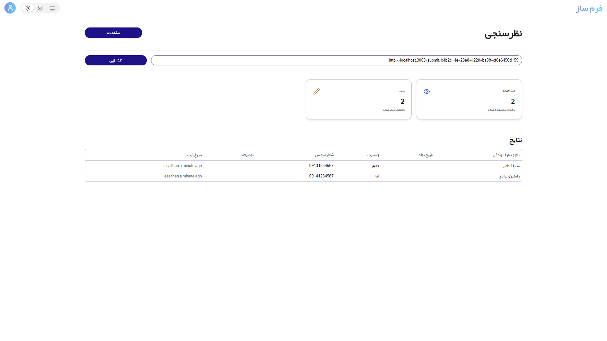
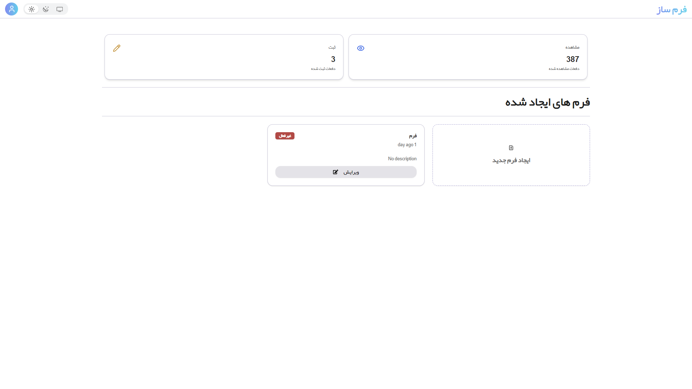
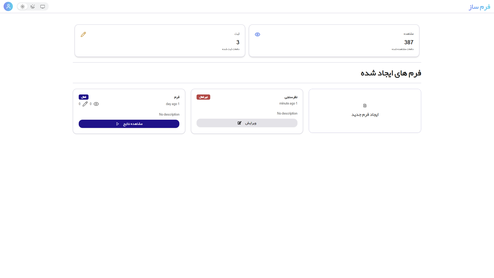
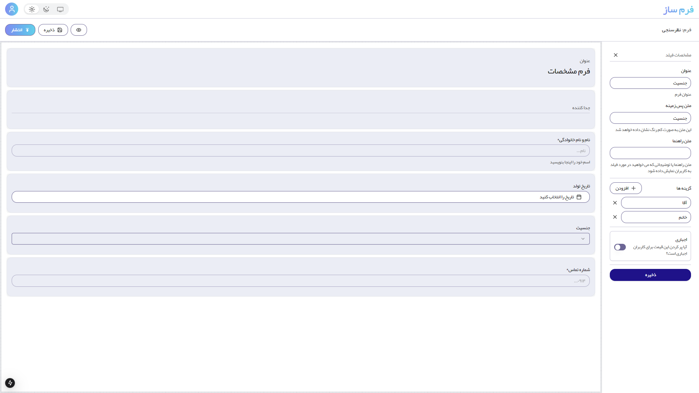
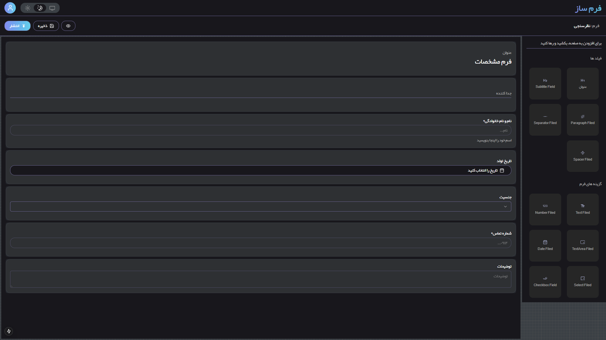

# FormBuilder - Drag-and-Drop Form Creator  

**FormBuilder** is a feature-rich **Next.js 15** web application that allows users to easily design, publish, and manage forms using an intuitive drag-and-drop editor. Whether you're building simple contact forms or complex data collection workflows, FormBuilder makes the process seamless and efficient.  

This project leverages modern tools and frameworks, including **Prisma**, **React DnD Kit**, **ShadCN**, **Tailwind CSS**, and **NextAuth**, ensuring scalability, flexibility, and an elegant user experience.  

---

## 🚀 Features  

### 🔑 User Authentication  
- **Register**: Sign up using either an email address or a mobile phone number.  
- **Secure Authentication**: Powered by **NextAuth** for robust and secure user login management.  

### 🏠 Dashboard  
- **Centralized Management**: A user-friendly dashboard to manage all your forms and submissions.  
- **Add New Forms**: Quickly create a new form and jump directly into the editor.  

### ✏️ Drag-and-Drop Editor  
- **Easy to Use**: Add fields such as text inputs, dropdowns, checkboxes, and more with a simple drag-and-drop interface.  
- **Customizable Forms**: Rearrange, edit, and style your form elements effortlessly.  
- **Rich UI**: Built using **React DnD Kit** and **ShadCN** components for a polished and modern experience.  

### 🌐 Publishing & Sharing  
- **Save and Publish**: Save your form designs and make them instantly accessible.  
- **Shareable Links**: Get a unique URL for each form to share with others for filling out.  

### 📊 Submission Tracking  
- **View Submissions**: See all submitted form data directly from your dashboard.  
- **Data Insights**: Manage and analyze submission data for better decision-making.  

---

## 🛠️ Tech Stack  

- **Next.js 15**: A React framework for building fast and scalable web applications.  
- **Prisma**: A modern ORM for interacting with the database.  
- **React DnD Kit**: Provides drag-and-drop functionality for form editing.  
- **ShadCN**: A customizable UI component library.  
- **Tailwind CSS**: For beautiful and responsive styling.  
- **NextAuth**: Handles user authentication seamlessly.  

---

## 🛑 Prerequisites  

Before running the application, make sure to configure the following environment variables in your `.env` file:  

```env
DATABASE_URL='mysql://<your-username>:<your-password>@localhost:3306/<your-database>'
AUTH_SECRET='<your-auth-secret>'
RESEND_API_KEY='<your-api-key>'
NEXTAUTH_URL='http://localhost:3000'
AUTH_TRUST_HOST='http://localhost:3000'

## 🛠️ Installation & Setup  

### Clone the Repository  
```bash
git clone https://github.com/yourusername/formbuilder.git  
cd formbuilder

### Install Dependencies
npm install

### Run Database Migrations
npx prisma migrate dev

### Start the Development Server
npm run dev
```


## 🔧 Future Features  

- **Form Templates**: Pre-designed templates for quick form creation.  
- **Advanced Analytics**: Gain deeper insights into form submissions.  
- **Integration Options**: Add support for webhooks and third-party integrations like Google Sheets and Zapier.  

---

## 📜 License  

This project is licensed under the **MIT License**. Feel free to fork, modify, and contribute!  

---

Start building your forms today and experience the simplicity and power of **FormBuilder**!  


## Features Showcase

<table>
  <tr>
    <td align="center">
      
      <p>Feature 1</p>
    </td>
    <td align="center">
      
      <p>Feature 2</p>
    </td>
  </tr>
  <tr>
    <td align="center">
      
      <p>Feature 3</p>
    </td>
    <td align="center">
      
      <p>Feature 4</p>
    </td>
    <td align="center">
      
      <p>Feature 4</p>
    </td>
  </tr>
</table>


